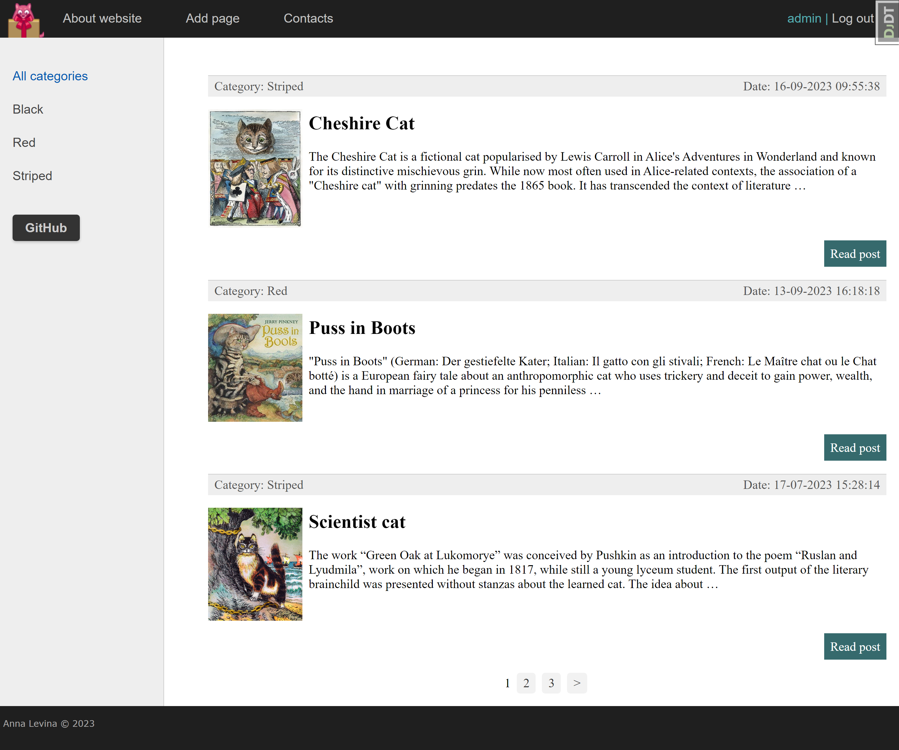

# Famous Cats - Сайт о знаменитых кошках в литературе и кино

Этот проект представляет собой веб-приложение на Django, посвященное известным кошкам, которые стали популярными в литературе и кино. Пользователи могут просматривать информацию о знаменитых кошках, читать статьи о них, добавлять свои собственные статьи и оставлять отзывы.

## Основные функции

- Просмотр списка знаменитых кошек.
- Просмотр отдельных статей о кошках.
- Добавление новых статей (требуется авторизация).
- Регистрация новых пользователей.
- Авторизация пользователей.
- Форма обратной связи.

### Запуск на сервере:

1. Склонировать репозиторий
- `git clone "https://github.com/levina-anna/Django_learn.git"`
- `cd Django_learn`

2. Поставить виртуальное окружение
- `python3 -m venv venv`
- `source venv/bin/activate`

3. Установить зависимости
- `pip install -r requirements.txt`

4. Применить миграции:
- `python manage.py migrate`

5. Запустить
- `cd gvksite/`
- `python manage.py runserver 0.0.0.0:8001`

### Требования к окружению

- Python 3.x
- Django 3.x